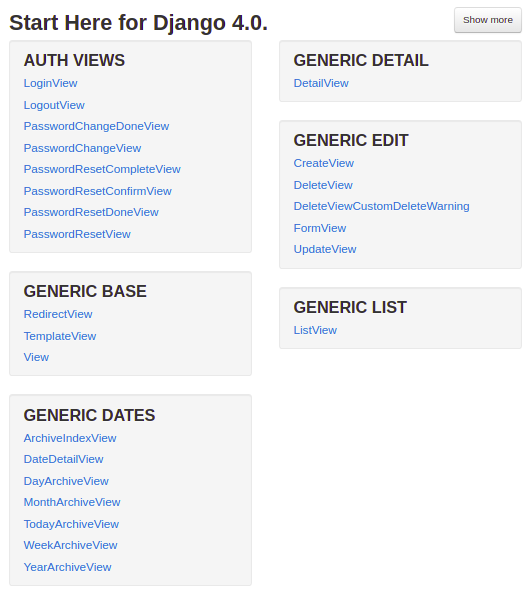
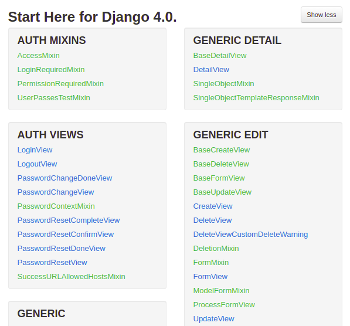
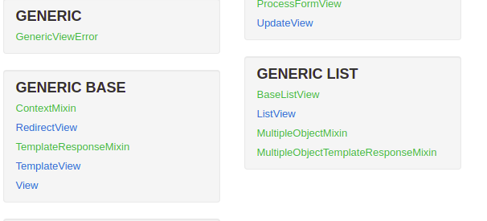
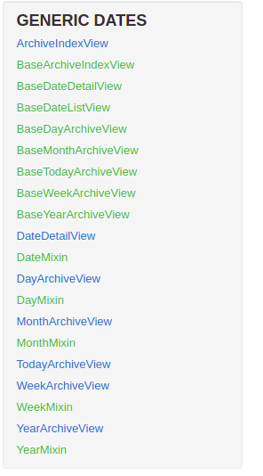

# Django First Project  

## Install Django  
`pip install django`

## Create a new Django project  
`django-admin startproject newsite`

## Create a new Django app  
`cd newsite`
`python manage.py startapp myapp`

## Start server  
`python manage.py runserver`

## Create superuser
`python manage.py createsuperuser`

## Make migrations  
`python manage.py makemigrations myapp`
`python manage.py migrate`

## Django Shell  
`python manage.py shell`


## Models  

### To create objets  
go to myapp/models.py
`from django.db import models`
make a class
`class MyClass(models.Model):`
and add fields from models.SomeField
e.g.
> atrribute id can be omitted because it is automatically created by django  

`name = models.CharField(max_length=200)`
`some_date = models.DateTimeField('date published')`

### To Objects with time atributes:  
`from django.utils import timezone`
To create a instance of the class in the shell:
```
from myapp.models import MyClass
# you can view all registered
MyClass.objects.all()

# to add new register

new_register = MyClass(name='new_register', some_date=timezone.now())
new_register.save()
```

### Access to objects data in shell  
`from myapp.models import MyClass`
`MyClass.objects.all()`  
Mods to acces data:  

> Can be used in get, filter, exclude
> - `attr__contains = value` -> Contains value in attr  
> - `attr__icontains = value` -> Contains value in attr, case insensitive
> - `attr__exact = value` -> Exact value in attr  
> - `attr__iexact = value` -> Exact value in attr, case insensitive
> - `attr__gt = value` -> Greater than value in attr  
> - `attr__gte = value` -> Greater than or equal to value in attr  
> - `attr__lt = value` -> Less than value in attr  
> - `attr__lte = value` -> Less than or equal to value in attr  
> - `attr__in = [value1, value2, ...]` -> In value in attr  
> - `attr__isnull = True` -> Is null in attr  
> - `attr__year = value` -> Year value in attr
> - `attr__month = value` -> Month value in attr
> - `attr__day = value` -> Day value in attr
> - `attr__hour = value` -> Hour value in attr
> - `attr__minute = value` -> Minute value in attr
> - `attr__second = value` -> Second value in attr

## Add views and urls  
in myapp/views.py create the functions for the views  
in myapp/urls.py create the urls  
the path parameters can be send with the url
`path('<int:id>/', views.detail, name='detail')`

## Work with templates
mkdir -p myapp/templates/myapp

## Work with links  
in myapp/urls.py add the next variable  
app_name = 'myapp'  
to reference the app in the template  
``  
  
tags for templates:  
> - [Built-in template tags and filters](https://docs.djangoproject.com/en/4.0/ref/templates/builtins/)  
> - [The Django template language](https://docs.djangoproject.com/en/4.0/ref/templates/language/)

## [Class Based Views](https://docs.djangoproject.com/en/4.0/topics/class-based-views/)
[Can check it too](http://ccbv.co.uk/)  








## Tests  
Regulary tests be to check:  
> - Models
> - Views